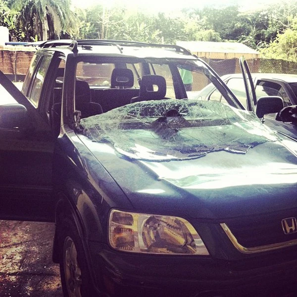

Recently, my roommate Eric and I have been a little stressed with our jobs here in Jarabacoa, So both of us decided that this weekend would be a good time to escape to the beach for a day for some R&R. We may have been more rested and recovered without it.

As I should have learned by now, Eric’s car is not so reliable. About half way to the beach, on our way up a mountain, the car started to overheat. We stopped for awhile, opened the hood to check things out, and let the car cool down. While we waited, Eric told me how the radiator had exploded for the previous owner, splattering boiling coolant fluid all over the hood and windshield. We both agreed it would be good to take it easy driving up the mountains.

Once the car was cooled down and we were ready to get back on the road, we found that the hood wouldn’t latch securely. As we were trying to fix the latch, a Dominican driving by on his motorcycle stopped and helped us tie down the hood with a rubber strap. Definitely a hack, but it seemed like it would hold and soon we were back on our way, driving slowly up the mountain.

Once we were over the mountain, and coming back down the other side, we were able to drive faster again, since the engine wasn’t being pushed so hard and the airflow was keeping things cool. We were cruising along, happily approaching the beach at 50mph when suddenly, BOOM! The hood of the car flew up, shattering the windshield in our faces and blocking our vision! Thankfully, no glass actually cut our faces or got in our eyes, and we were on a straight road and Eric was able to safely stop the car before we hit anything or ended up off-road in a huge ditch or down the side of a mountain.

Though public infrastructure and assistance isn’t so common, Dominicans are very eager to help a stranger. Within 30 seconds, another Dominican stopped to help. He was the manager of a garage about five minutes away, so he helped us get the car there, where they removed the windshield and used an air compressor to blow all of the glass fragments off of the dashboard and seats. A couple of hours later, we were back on our way to the beach.

We had left at 9:30 in the morning to go to a beach less than two hours away. By the time we got there, it was 3:30 in the afternoon. We got to swim in a beautiful crystal clear ocean and read in our hammocks for a few hours. We had a nice Dominican-style dinner, and then drove three hours slowly back to Jarabacoa without a windshield, and nervously watching the temperature gauge to make sure that the radiator wouldn’t overheat and explode.

We’re both a little overwhelmed having experienced such a string of crazy events. But we both agree that living in the Dominican Republic is teaching us to go with the flow and realize that not everything is always under our control, but that’s ok. We’re learning to be more patient and to accept things for how the are. And to be thankful for what we have, because it really is a lot, even when we hit a rough patch.
