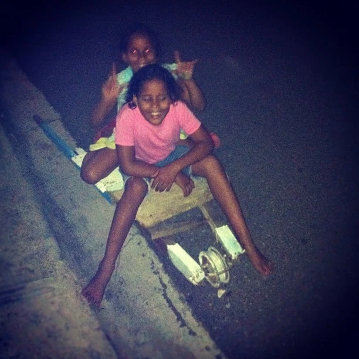
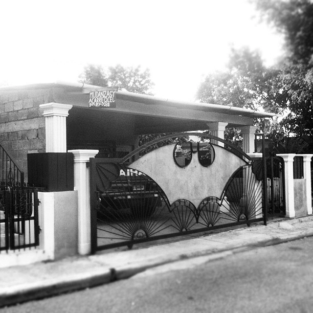

A few weeks ago, I moved into a new house in Jarabacoa with two other roommates. My first couple of weeks here, I lived with a host family who were very generous and welcoming as I began my transition to living in Dominican culture. Living in this new house is allowing me to transition more into life and experiences here.

One of the things that I am excited about living in my own apartment is the ability to host friends. It is common in Dominican culture to gather at friends’ houses, rather than going out together. Without having my own place where I could host friends, I felt that it was difficult to initiate or reciprocate friendships with Dominicans, but now, thankfully, I have that ability.

Having friends over to my house has given me more opportunities to learn Spanish, which is something I absolutely enjoy doing, and allowed me to experience Latin America’s famous dancing talent (and my own comparative lack of dancing talent) first hand. If you’re wondering why I’m not in this picture, you’ve obviously never seen me try to dance.

I’ve also been able to take my experience with Dominican cuisine to the next level, now that I have my own kitchen. I’ve learned how to cook yuca frita, salami, queso frito and tostones (all Dominican favorites) and I’ve discovered, surprisingly, that though they live in a country full of cheap avocados, most Dominicans have never heard of guacamole. Here, apparently, it’s a “gringo thing”.

One of the downsides of living in a new place is that it is farther from where I work, and I haven’t been able to afford a motorcycle yet. The neighbor girls offered to let me use their “carro”, but it’s not exactly my style.

I’ve been using my longboard to get to work. Though the streets are a little rough, it’s always entertaining with the reactions I get from people on the street. This week, on my way home, a motorcycle taxi driver asked if he could try my longboard. He quickly attracted a crowd of people, and though he swore he knew what he was doing, I don’t think he ever rode a longboard before.

So, the longer commute isn’t so bad. It’s also allowed me to explore more of Jarabacoa. I found that Batman apparently has a vacation home here.

And when I finally get home from work, I can relax on my porch and enjoy the view. I definitely miss the beautiful fall weather in Ohio, but this view can definitely compete.

