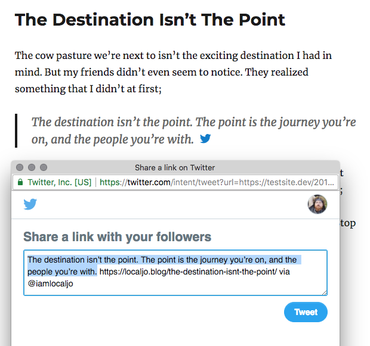

If you know me at all, you know that I’m a big fan of both Twitter and WordPress. I love how both platforms make it easy for people to share ideas and communicate openly and freely. I love that both serve as a sort of “public square” of the web and support discourse, democracy and free society.

I’ve been inspired lately by the ways that some websites have integrated Twitter, and I wanted to bring the same kind of integration to WordPress and take it a step further; helping WordPress bloggers to spark discussions and discourse on Twitter and other social media sites with the powerful statements they are already making.

So, I made a WordPress plugin that does exactly that. The plugin was mostly inspired by two sources. The first was the toolbar on Medium.com that enables people to tweet or comment on the text they select. The second was [Donald Miller’s Storyline blog](http://storylineblog.com), where he’s been adding “(tweet this)” links to the end of quotes worth sharing. The plugin is called [Quotable](http://wordpress.org/plugins/quotable/), and it brings both of those ideas to WordPress.

Quotable helps readers share your inspiring content in two ways; first, by highlighting the text that they like and clicking one button to share it on Twitter. Second, by adding a link to the bottom of all the block quotes in a post, that will instantly share it.

> Quotable helps your readers share inspiring quotes from your site and spark engaging dialogue.

The plugin serves two crowds; the readers of WordPress blogs that have the Quotable plugin installed will be able to quickly and easily share quotes that they like, and the authors of WordPress blogs benefit from the increased sharing of their content.

The plugin is written in a way that enhances existing features of [Yoast’s WordPress SEO plugin](https://yoast.com/wordpress/plugins/seo/). If a site uses that plugin to define Twitter accounts for the site and it’s authors, those accounts will be mentioned in the tweets created by Quotable, which will encourage new followers and create new readers.

If you manage a WordPress site, I’d love it if you [give Quotable a try](http://wordpress.org/plugins/quotable/). It’s the first version, and I hope to improve it as time goes on, so I would greatly appreciate your feedback. If you try it and like it, please share it with others. I hope that this plugin not only enhances your site, but also benefits discourse, and free speech on the web.
